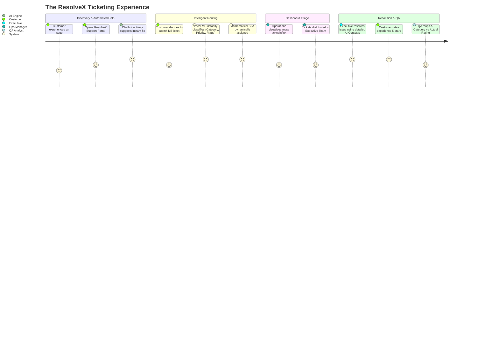
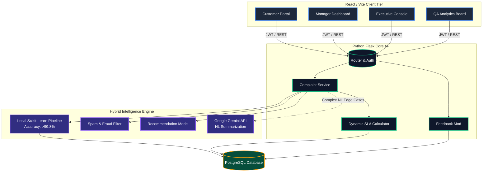
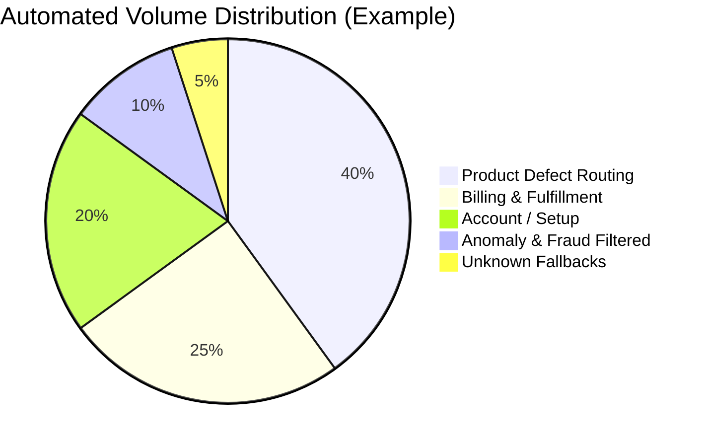
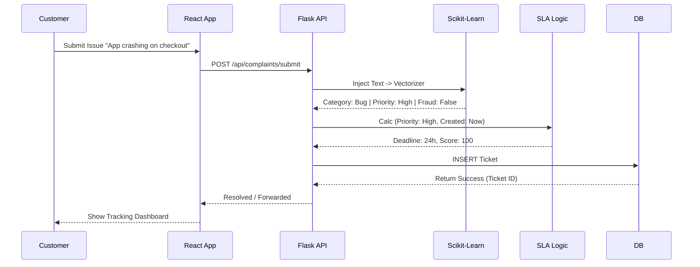
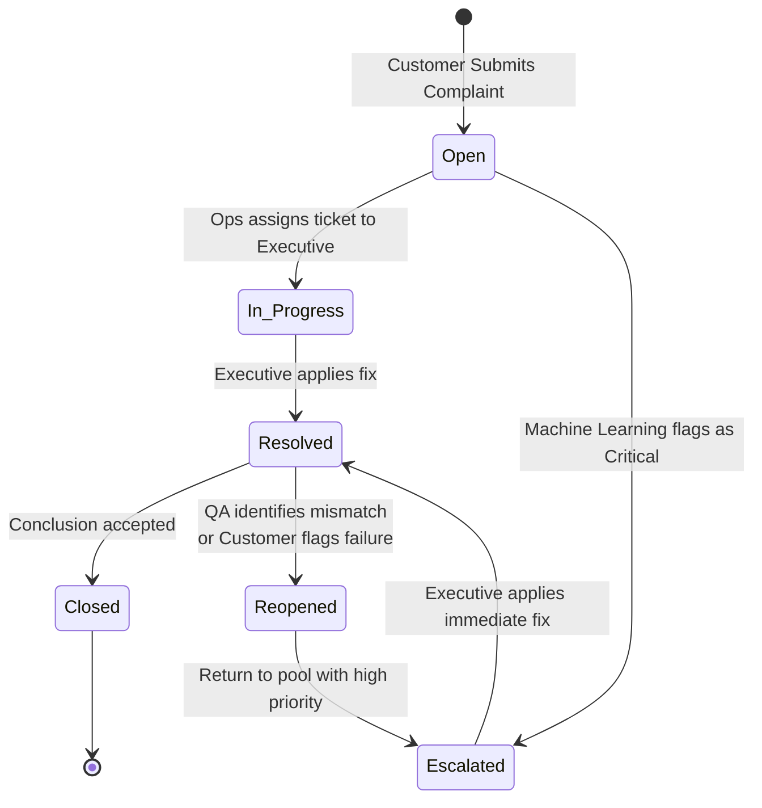

<div align="center">
  
  
  
  
  
  <br />
  <h1>🚀 ResolveX CRM & SLA Engine</h1>
  <p><strong>The Next-Generation AI-Driven Support Ecosystem</strong></p>
  <p>Engineered for maximum operational efficiency, combining high-speed Local ML with generative AI to route, classify, and resolve tickets instantly.</p>
</div>

<br />

---

## 📖 Table of Contents
- [Executive Overview](#-executive-overview)
- [System Architecture (Data Flow)](#-system-architecture)
- [The Hybrid AI Pipeline](#-the-hybrid-ai-pipeline)
- [SLA Tracking Engine](#-sla-tracking-engine)
- [Multi-Tier Dashboards](#-multi-tier-dashboards)
- [Technology Stack](#-technology-stack)
- [Local Installation Guide](#-installation-guide)

---

## 🎯 Executive Overview
**ResolveX** is an enterprise-grade Customer Support & Operations platform that eliminates manual ticket triage. Unlike standard helpdesks, ResolveX embeds **Machine Learning natively within the request lifecycle** to categorize intent, predict priority, flag duplication/fraud, and dynamically assign SLA countdowns in milliseconds before a human ever sees the queue.

It is built around four central personas:
1. **The Customer:** Experiences instant AI auto-resolution via a Copilot interface.
2. **Operations Manager:** Monitors live queue processing and resolves flagged edge cases.
3. **Support Executive:** Works on critical escalations with precise contextual summarizations.
4. **Quality Assurance (QA):** Monitors historical AI accuracy, overrides misclassifications, and reviews customer feedback logic.



---

## 🏗 System Architecture

The following details the full-stack architecture, detailing how the unified frontend distributes to role-locked views, hits the Python middleware, and gets triaged by our proprietary Machine Learning engine.



---

## 🤖 The Hybrid AI Pipeline

ResolveX ditches the traditional "100% LLM API" approach (which is costly and slow) in favor of a blazing-fast Hybrid Pipeline.

### 1. High-Speed Local Classification
Using `Scikit-Learn` and serialized `joblib` artifacts, ResolveX executes the primary pipeline completely locally in under **~15 milliseconds**:
- **Category Classifier:** Text vectorization mapping intents to fixed categorical queues.
- **Priority Predictor:** Sentiment mapping returning strict bounds (Low, Medium, High, Critical).
- **Fraud/Spam Filter:** Anomaly detection looking for malicious payloads or zero-effort text.
- **Recommendation Engine:** Maps known category arrays to immediate solution protocols.



### 2. Generative Fallback
The Google **Gemini API** is utilized strictly for Natural Language (NL) conversational interactions directly with the customer through the chatbot interface, acting as a friendly conversational layer that wraps the rigid structural outputs of our local ML.



---

## 🚦 Ticket Lifecycle (State Diagram)

Every ticket routes through a strict programmatic state machine ensuring no issues are ignored.



---

## ⏰ SLA Tracking Engine

A custom algorithmic service calculates strict adherence to time constraints.
$$ SLA\_Score = \min\left(100, \left( \frac{\text{Remaining Time}}{\text{Total Allocated Time}} \times 100 \right) \times P_{weight}\right) $$

**Priority Multipliers ($P_{weight}$):**
- **Critical:** 2.0x weight (Strict 6hr resolution bound)
- **High:** 1.5x weight (12hr bound)
- **Medium:** 1.2x weight (24hr bound)
- **Low:** 1.0x weight (48hr bound)

The dashboard cleanly reflects SLA statuses globally:
- 🟢 **On Track** (Score > 70)
- 🟠 **At Risk** (Score 31-70)
- 🔴 **Breached** (Score < 30)

---

## 📊 Multi-Tier Dashboards

| Persona               | UI Capabilities                                                                 | Key Tech Features                                      |
| --------------------- | ------------------------------------------------------------------------------- | ------------------------------------------------------ |
| **Customer**          | Multi-channel submission, AI Chatbot overlay, live status tracking, Feedback     | WebSockets/Polling, Gemini Conversational AI           |
| **Operations**        | Live list grid, Ticket Audit logging, Mass resolution logic                      | Debounced Data Grids, React State Optimization         |
| **Executive Support** | Focused SLA inspection pane, Copilot detailed drawer view                        | Custom SLA Capsule rendering, Component Modals         |
| **Quality Assurance** | Data Analysis Overview, Misclassification override matrix, Verified Rating Sync | `Recharts` for analytical charting, dynamic ML mapping |

---

## 🛠 Technology Stack

### **Frontend Tier**
- **Framework:** React.js + Vite 🔥
- **Styling:** Custom CSS Design System (Tailwind-inspired tokenized methodology)
- **Routing:** React Router v6
- **Data Viz:** Recharts, Lucide-React Icons

### **Backend API**
- **Framework:** Python (Flask + Blueprint routing)
- **Database:** PostgreSQL (with `psycopg2`)
- **AI Processing:** `scikit-learn`, `numpy`, `pandas`, `scipy`
- **GenAI Interface:** Google `google-generativeai`

---

## 🚀 Installation Guide

### Prerequisites
- Node.js (v18+)
- Python (3.9+)
- PostgreSQL Server Instance

### 1. Database Setup
Execute the initialization script to generate the database schema.
*Requires PostgreSQL running on your machine.*

### 2. Python Backend Initialization
```bash
cd Backend
python -m venv venv
source venv/bin/activate  # On Windows: venv\Scripts\activate
pip install -r requirements.txt

# Start the server (Defaults to Port 5000)
python app.py
```
> **Note:** Ensure you place your `.env` file in the `/Backend` directory with your PostgreSQL connection URL and `GEMINI_API_KEY`.

### 3. React Frontend Launch
```bash
cd Frontend
npm install
npm run dev
```

---

<div align="center">
  <i>Built to redefine the standard of SaaS Customer Operations.</i><br>
  <b>ResolveX Architecture Team</b>
</div>
